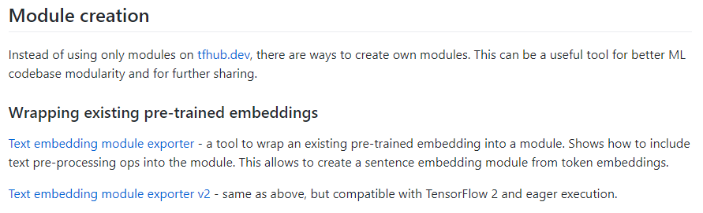
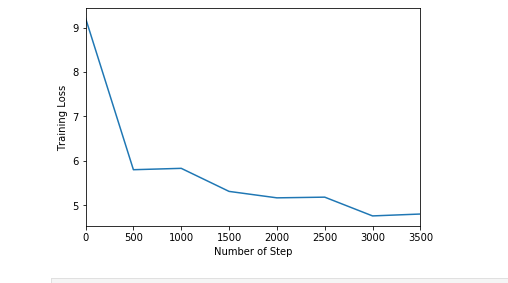

# GSOC 2019
### Part 1

* [Pretrained embedding exporter tool](https://github.com/tensorflow/hub/tree/master/examples/text_embeddings_v2) to convert embedding .txt or .vec files to tensorflow module in savedmodel format. Also included in [Text Cookbook](https://github.com/tensorflow/hub/blob/master/docs/tutorials/text_cookbook.md) of TF-Hub.

* Minor fixes in Text Classification With Kaggle Notebook. [Link](https://github.com/tensorflow/hub/blob/master/examples/colab/text_classification_with_tf_hub_on_kaggle.ipynb) here.

### Part 2

Demonstration [notebook](https://github.com/tensorflow/hub/blob/master/examples/colab/bangla_article_classifier.ipynb) that uses the embedding exporter tool to classify articles in Bangla using FastText embeddings. 

### Part 3

Prototype module that tries to implement [ULMFiT](https://arxiv.org/abs/1801.06146) technique from Fastai NLP research. It implements a language model module that is trained on [Wikitext-103](https://blog.einstein.ai/the-wikitext-long-term-dependency-language-modeling-dataset/) dataset, then finetunes on [IMDB sentiment classification](https://ai.stanford.edu/~amaas/data/sentiment/) dataset to classify imdb reviews. Still buggy implementation. Details are in the notebooks and scripts included above.

Training loss of language model : 

